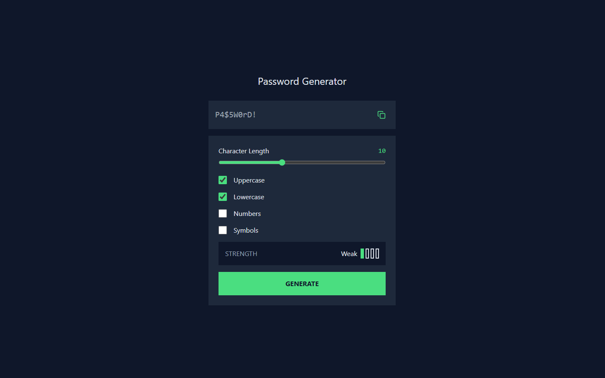

# Frontend Mentor - Password generator app solution

This is a solution to the [Password generator app challenge on Frontend Mentor](https://www.frontendmentor.io/challenges/password-generator-app-Mr8CLycqjh). Frontend Mentor challenges help you improve your coding skills by building realistic projects. 

## Table of contents

- [Frontend Mentor - Password generator app solution](#frontend-mentor---password-generator-app-solution)
  - [Table of contents](#table-of-contents)
  - [Overview](#overview)
    - [The challenge](#the-challenge)
    - [Screenshot](#screenshot)
    - [Links](#links)
  - [My process](#my-process)
    - [Built with](#built-with)
    - [What I learned](#what-i-learned)
    - [1. Custom Hook Implementation](#1-custom-hook-implementation)
    - [2. Semantic HTML \& Accesibility](#2-semantic-html--accesibility)
    - [3. Clipboard API](#3-clipboard-api)
    - [4. State Management Patterns :](#4-state-management-patterns-)
    - [Useful resources](#useful-resources)
    - [Author](#author)

## Overview

### The challenge

Users should be able to:

- Generate a password based on the selected inclusion options
- Copy the generated password to the computer's clipboard
- See a strength rating for their generated password
- View the optimal layout for the interface depending on their device's screen size
- See hover and focus states for all interactive elements on the page

### Screenshot



### Links

- Solution URL: [Add solution URL here](https://your-solution-url.com)
- Live Site URL: [Add live site URL here](https://your-live-site-url.com)

## My process

### Built with

- Semantic HTML5 markup
- Flexbox
- Mobile-first workflow
- [React](https://reactjs.org/) - JS library
- [Tailwindcss](https://tailwindcss.com/) - For styles

### What I learned

### 1. Custom Hook Implementation

Created a reusable password generator hook:

```jsx
const usePasswordGenerator = () => {
  const [password, setPassword] = useState("");
  // ...configuration state
  
  const generatePassword = useCallback(() => {
    // Password generation logic
  }, [length, options]);
  
  return { password, generatePassword /* ...other values */ };
};
```
### 2. Semantic HTML & Accesibility

Improved screen reader support with ARIA attributes: 

```html
<div 
  role="meter"
  aria-valuenow={strength}
  aria-valuemin="0"
  aria-valuemax="4"
  aria-label={`Password strength is ${label}`}>
  {/* Strength indicator bars */}
</div>
```


### 3. Clipboard API 

Learned modern clipboard handling: 

```jsx
const copyToClipboard = async () => {
  try {
    await navigator.clipboard.writeText(password);
    setCopied(true);
    setTimeout(() => setCopied(false), 2000);
  } catch (err) {
    console.error("Failed to copy:", err);
  }
};
```

### 4. State Management Patterns :

Implemented complex state updates with useCallback:

```jsx
const calculateStrength = useCallback(() => {
  let score = 0;
  if (length >= 8) score++;
  // ...more conditions
  setStrength(Math.min(Math.floor((score / 6) * 4), 4));
}, [length, options]);
```

### Useful resources

- [lucide-react ](https://lucide.dev/guide/packages/lucide-react) - This icon library helped me borrow some icons.

### Author

- Frontend Mentor - [@Clotho-ex](https://www.frontendmentor.io/profile/Clotho-ex)
- Twitter - [@lachesis_](https://x.com/lachesis_)
